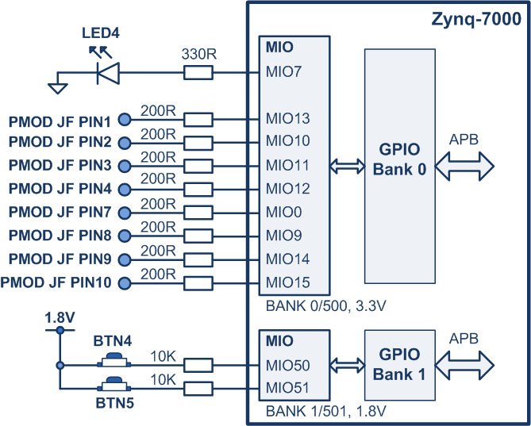

# zynq-cpp-sandbox
This is my sandbox for exploring the use of C++ to develop projects for the AMD (Xilinx) Zynq.
Points:
- Main aim is to begin the process of creating a range of c++ drivers which can be re-used for other Zynq-7000/Ultrascale/Microblaze designs. 
- Simple 'skeleton' drivers, not fully functional, not fully tested.
- A lot of the underlying C code is still being used. For example:
  - The ```xparameters.h file``` is used for accessing system paramters and settings.
  - The Xilinx interrupt driver code has not been rewritten as c++ code, etc.
- Very little defensive code is used in the drivers as they curently stand.
- Having an understanding of Zynq HW, IP blocks and c-code drivers would be useful in the discussion below.

## Drivers
### AXI_GPIO (Programmable Logic GPIO IP)
[```axi_gpio.cpp, axi_gpio.h```](2023.2/zybo-z7-20/hw_proj1/vitis_classic/sw_proj5_cpp/src/classes)


The AxiGpio class is very simple, but it shows some basic principles that are repeated in other classes. For example, pointers to each register in the driver are included in the private data of the class. (Note that the interrupt functionality is not included in this first version. Also note that using pointers for each register might not be a great idea on resource-constrained uControllers or for drivers with a large register set, but it is fine for this exploratory work on the Zynq i.e. small drivers on memory-rich devices.)
```c++
  private:
	device_reg *p_CH1_DATA_REG { nullptr };
	device_reg *p_CH1_TRI_REG { nullptr };
	device_reg *p_CH2_DATA_REG { nullptr };
	device_reg *p_CH2_TRI_REG { nullptr };
```
The ```device_reg``` is an alias for a volatile uint32_t data type:
```c++
using device_reg = std::uint32_t volatile;
```

When the constructor for the device is called, the private data pointers are set to the correct HW value using the ```reinterpret_cast``` operation.

```c++
AxiGpio::AxiGpio(std::uint32_t base)
{
	p_CH1_DATA_REG = reinterpret_cast<device_reg*>(base + offset::gpio::CH1_DATA);
	p_CH1_TRI_REG = reinterpret_cast<device_reg*>(base + offset::gpio::CH1_TRI);
	p_CH2_DATA_REG = reinterpret_cast<device_reg*>(base + offset::gpio::CH2_DATA);
	p_CH2_TRI_REG = reinterpret_cast<device_reg*>(base + offset::gpio::CH2_TRI);
 }
```

When creating the AXI GPIO object, the base address must be passed to the contructor. This is not necessarily the case for the other drivers discussed below, but the AXI IP functionality is very dependent on the users programmable logic design in that multiple blocks can be created and the base addresses can be changed. To accomodate this uncertainty I also have a file called ```axi_reg.h``` which the user can modify as needed. (```xparameters.h``` is still used to get the system info i.e. ```XPAR_GPIO_0_BASEADDR``` in this case.) The register offsets are also included in ```axi_reg.h```.
```c++
namespace axi
{
  namespace reg
  {
  	  namespace base_addr
	  {
      	  constexpr std::uint32_t gpio0			= std::uint32_t(XPAR_GPIO_0_BASEADDR);
      	  constexpr std::uint32_t spi0			= std::uint32_t(XPAR_SPI_0_BASEADDR);
	  } // base_addr


  	  // REGISTER OFFSETS
  	  namespace offset
	  {
  	  	  // GPIO OFFSETS
  	  	  namespace gpio
		  {
			constexpr std::uint16_t CH1_DATA		= 0;
			constexpr std::uint16_t CH1_TRI			= 0x0004;
			constexpr std::uint16_t CH2_DATA		= 0x0008;
			constexpr std::uint16_t CH2_TRI			= 0x000C;

			constexpr std::uint16_t GBL_INTR_EN		= 0x011C;
			constexpr std::uint16_t INTR_STATUS		= 0x0120;
			constexpr std::uint16_t INTR_ENABLE		= 0x0128;
		  }  // gpio
  	  } // offset


  } // reg
} // axi
```
<br/><br/>

The AXI GPIO object is created in ```system_config.cpp```. It's a static object (i.e. file-scoped to ```system_config.cpp```), and a pointer is also created in the ```sys_init()``` function so that other code can access the GPIO functions. (That is, the pointer can be passed around, giving some control over who has access to the AXIO GPIO block.)
```c++
// system_config.cpp: Call constructor to create the AXI GPIO object
static AxiGpio	AxiGpio0(axi::reg::base_addr::gpio0);

sys_init() {
...
// Create pointer to the AXI_GPIO object: 
AxiGpio* p_AxiGpio0 = &AxiGpio0;
...
}
```

To accomodate flexibility at the board level, I have a namespace called ```board::gpio::pin_names::axi``` in a file called ```settings.h```. This maps out the GPIO connections at the board level:
```c++
namespace board
{
	namespace gpio
	{
		namespace pin_names
		{
			namespace axi
			{
				// CHANNEL 1 (ALL OUTPUTS)
				constexpr std::uint8_t LED0				= 0;
				constexpr std::uint8_t LED1				= 1;
				constexpr std::uint8_t LED2				= 2;
				constexpr std::uint8_t LED3				= 3;
				constexpr std::uint8_t PMOD_JE_PIN1		= 4;
				constexpr std::uint8_t PMOD_JE_PIN2		= 5;
				constexpr std::uint8_t PMOD_JE_PIN3		= 6;
				constexpr std::uint8_t PMOD_JE_PIN4		= 7;

				// CHANNEL 2 (ALL INPUTS)
				constexpr std::uint8_t BTN0				= 0;
				constexpr std::uint8_t BTN1				= 1;
				constexpr std::uint8_t BTN2				= 2;
				constexpr std::uint8_t BTN3				= 3;
				constexpr std::uint8_t SW0				= 4;
				constexpr std::uint8_t SW1				= 5;
				constexpr std::uint8_t SW2				= 6;
				constexpr std::uint8_t SW3				= 7;
				constexpr std::uint8_t PMOD_JE_PIN7		= 8;
				constexpr std::uint8_t PMOD_JE_PIN8		= 9;
				constexpr std::uint8_t PMOD_JE_PIN9		= 10;
				constexpr std::uint8_t PMOD_JE_PIN10	= 11;
			} // axi
		} // pin_names
	} // gpio
} // board
```
I also have a file called ```common.h``` which contains entities that might be used for different modules (i.e. AXI GPIO and PS GPIO):
```c++
namespace common
{
	enum class GpioOperation {Set, Clear, Toggle};
	enum class BankType {mio, emio};
	enum class Direction {Input, Output};
}
```

Finally, here are some examples of how to toggle an LED, or set/clear PMOD pins:
```c++
p_AxiGpio->writeCh1Pin(LED1, GpioOperation::Toggle);
p_AxiGpio->writeCh1Pin(PMOD_JE_PIN1, GpioOperation::Set);
p_AxiGpio->writeCh1Pin(PMOD_JE_PIN1, GpioOperation::Clear);
```


### PS7 GPIO
[```ps_gpio.cpp```, ```ps_gpio.h```](2023.2/zybo-z7-20/hw_proj1/vitis_classic/sw_proj5_cpp/src/classes)

The GPIO block internal to the Zynq APU is interesting as it is part of the very flexible MIO system. MIO stands for multiplexed IO, and it means that a range of peripherals (I2C, UART, SPI, GPIO, etc) can be mapped to the limited pinout on the processing side of the Zynq. The GPIO block for the Zynq-7000 is quite large, having four banks comprising a total of 118 pins, but usually only a small range of pins will be left over once the other peripherals are allocated. The upper two banks can however be routed through the programmable logic to available pins in that section. The basic layout is shown below. (Note that there are six banks in Ultrascale devices: 3 MIO and 3 EMIO.)


<br/><br/>

The MIO configuration for the current project is shown below. The LED and two switches are fixed at board layout time. The PMOD header is more flexible as other peripherals can use these pins after the board is created; however, in this project we simply use them as GPIO pins.


<br/><br/>

The PS GPIO driver class diagram is shown below. In fact two classes are involved, and a PsGpio object is created using the OOP principle of composition: PsGpioBank represents an individual bank, and PsGpio is composed of an array of four banks. (In an Ultrascale device, PsGpio would be made up of six PsGpioBank's.) 


<br/><br/>

The constructor for a single bank is as follows:
```c++
PsGpioBank::PsGpioBank(std::uint16_t bank_number)
{
	// General settings
	m_bank_number = bank_number;
	m_bank_addr = bank_base_addr[bank_number];
	m_bank_type = bank_type[bank_number];
	m_bank_size_hex = bank_size_hex[bank_number];
	m_bank_size_offset = bank_size_offsets[bank_number];
	m_bank_gpio_allowed = bank_gpio_allowed[bank_number];

	// Register pointers
	p_MASK_DATA_LSW_REG = reinterpret_cast<device_reg*>(m_bank_addr + MASK_DATA_LSW);
	p_MASK_DATA_MSW_REG = reinterpret_cast<device_reg*>(m_bank_addr + MASK_DATA_MSW);
	p_DATA_WRITE_REG = reinterpret_cast<device_reg*>(m_bank_addr + DATA_WRITE - (m_bank_number*0x4));
	p_DATA_READ_REG = reinterpret_cast<device_reg*>(m_bank_addr + DATA_READ - (m_bank_number*0x4));

	p_DIR_MODE_REG = reinterpret_cast<device_reg*>(m_bank_addr + DIR_MODE + (m_bank_number*0x38));
	p_OUTPUT_ENABLE_REG = reinterpret_cast<device_reg*>(m_bank_addr + OUTPUT_ENABLE + (m_bank_number*0x38));
	p_INTR_MASK_REG = reinterpret_cast<device_reg*>(m_bank_addr + INTR_MASK + (m_bank_number*0x38));
	p_INTR_ENABLE_UNMASK_REG = reinterpret_cast<device_reg*>(m_bank_addr + INTR_ENABLE_UNMASK + (m_bank_number*0x38));
	p_INTR_DISABLE_MASK_REG = reinterpret_cast<device_reg*>(m_bank_addr + INTR_DISABLE_MASK + (m_bank_number*0x38));
	p_INTR_STATUS_REG = reinterpret_cast<device_reg*>(m_bank_addr + INTR_STATUS + (m_bank_number*0x38));
	p_INTR_TYPE_REG = reinterpret_cast<device_reg*>(m_bank_addr + INTR_TYPE + (m_bank_number*0x38));
	p_INTR_POLARITY_REG = reinterpret_cast<device_reg*>(m_bank_addr + INTR_POLARITY + (m_bank_number*0x38));
	p_INTR_ANY_EDGE_SENSE_REG = reinterpret_cast<device_reg*>(m_bank_addr + INTR_ANY_EDGE_SENSE + (m_bank_number*0x38));
}
```

The constructor for the PsGpio object, then is as follows:

```c++
PsGpio::PsGpio(){
	for(int i=0; i <= n_banks; i++)
	{
		PsGpioBankArray[i] = PsGpioBank(i);
	}
}
```
The PsGpio object is created in ```system_config.cpp``` (again it is static, and a pointer is created in ```sys_init()``` to allow access to the GPIO functionality):
```c++
static PsGpio	PsGpio0;
```
The parameters required for object creation can be found in ```settings.h``` (see also ```common.h``` for the BankType definition):
```c++
namespace sys
{
	namespace ps_gpio
	{
		constexpr std::uint8_t n_banks				= 4; // Four GPIO banks in Zynq7000

		// Bank 0: MIO; Bank 1: MIO; Bank 2: EMIO; Bank 3: EMIO;
		constexpr BankType bank_type[n_banks]		= { BankType::mio, BankType::mio, BankType::emio, BankType::emio };

		// Bank 0: Pins 0,7,9,10,11,12,13,14,15; Bank 1: 50, 51; Bank 2: All pins; Bank 3: All pins
		constexpr std::uint32_t bank_gpio_allowed[n_banks] = { 0x0000FE81, 0x00060000, 0xFFFFFFFF, 0xFFFFFFFF };

		// Bank size: Bank 0: 32-bits; Bank 1: 22-bits; Bank 2: 32-bits; Bank 3: 32-bits
		constexpr std::uint32_t	bank_size_hex[n_banks] = { 0xFFFFFFFF, 0x003FFFFF, 0xFFFFFFFF, 0xFFFFFFFF };
		constexpr std::uint32_t	bank_size_offsets[n_banks] = { 32, 53, 85, 117 };

		// Bank 0: Pins 0,7,9,10,11,12,13,14,15 set to output.
		constexpr std::uint32_t bank_gpio_output[n_banks] = { 0x0000FE81, 0x00000000, 0x00000000, 0x00000000 };

		constexpr std::uint32_t bank_base_addr[n_banks] = { XPAR_PS7_GPIO_0_BASEADDR,
															XPAR_PS7_GPIO_0_BASEADDR + 0x8,
															XPAR_PS7_GPIO_0_BASEADDR + 0x10,
															XPAR_PS7_GPIO_0_BASEADDR + 0x18 };

	} // ps_gpio
} // sys
```

Finally, the PS GPIO functions can be used in a very similar fashion to the AXI GPIO functions (the interface has been designed so that the signatures are identical):

```c++
p_PsGpio->writePin(LED4, GpioOperation::Toggle);
p_PsGpio->writePin(PMOD_JF_PIN4, GpioOperation::Set);
p_PsGpio->writePin(PMOD_JF_PIN4, GpioOperation::Clear);

```

### SCU Timer, SCU Watchdog Timer
[```scutimer.cpp, scutimer.h, scuwdt.cpp, scuwdt.h```](2023.2/zybo-z7-20/hw_proj1/vitis_classic/sw_proj5_cpp/src/classes)

Each core in the Cortex-A9 MPCORE has an associated private timer and watchdog timer, known as the ScuTimer and ScuWDT respectively. These are labeled '2' and '3' below.


</br></br>

It turns out that these timers are almost identical, with the WDT simply having an extra couple of registers:


</br></br>

This means that a simple driver structure based on inheritance can be used for the timers; the ScuTimer is the parent class, and the ScuWdt is the child class:


</br></br>

The ScuTimer class contains the common registers and functionality. (Note that the Timer Registers must be declared as protected rather than private as they must also be used by the child class.):
```c++
class ScuTimer
{
  public:
	/* --- CONSTRUCTORS --------- */
	ScuTimer(std::uint32_t base);

	/* --- PUBLIC METHODS --------- */

	void configure(double time_seconds, bool auto_reload=true, bool irq_enable=true);
	void start(void); // Set the enable bit in CONTROL REG
	void stop(void); // Clear the enable bit in CONTROL REG
	bool getIntrStatus(void);
	void clearIntrStatus(void);
	void waitTimerExpired(void);

	void setLoad(float time_seconds);
	uint32_t getLoad(void);

	void setPrescaler(std::uint8_t prescaler);
	void clearPrescaler(void);
	uint16_t getPrescaler(void);

	void setAutoReload(bool val); // 'true' = enable, 'false' = disable AutoReload
	void setIrqEnable(bool val); // 'true' = enable, 'false' = disable IRQ


	// Set/Get user interrupt handler
	void setUserIntrHandler(p_ScuTimerIntrHandler p_handler);
	p_ScuTimerIntrHandler getUserIntrHandler(void);

	// test
	void printRegisters(void);

  protected: // Protected, as the ScuWdt timer class needs to inherit from this class.
	// Timer registers
	device_reg *p_LOAD_REG { nullptr };
	device_reg *p_COUNTER_REG { nullptr };
	device_reg *p_CONTROL_REG { nullptr };
	device_reg *p_ISR_REG { nullptr};

	p_ScuTimerIntrHandler p_UserInterruptHandler;

};
```

The ScuWdt class inherits from ScuTimer, and contains the extended features. It also contains its own version of the configure() fn, which allows it to enable watchdog mode:
```c++
class ScuWdt : public ScuTimer
{
  public:
	/* --- CONSTRUCTOR --------- */
	ScuWdt(std::uint32_t base);

	/* --- METHODS ------------- */

	void configure(double time_seconds, bool auto_reload=true, bool irq_enable=true);

	void setWatchdogMode(void);
	void clearWatchdogMode(void);
	void restart(void);

	// test
	void printRegisters(void);


  private:
	// Registers exclusive to watchdog mode:
	device_reg *p_RESET_STATUS {nullptr};
	device_reg *p_WATCHDOG_DISABLE {nullptr};

};
```

Both timer objects can be created seperately in ```system_settings.cpp```:
```c++
static ScuTimer	ScuTimerCore0(ps::reg::base_addr::scutimer0);
static ScuWdt	ScuWdtCore0(ps::reg::base_addr::scuwdt0);
```

The system timing is set later in ```sys_init()```;
```c++
/* ----------------------------------------------------------------*/
/* Set system timing                                               */
/* ----------------------------------------------------------------*/
p_ScuTimerCore0->configure(sys::timing::scutimer0_time_seconds); // (see system/settings.h

/* Set the user interrupt handler and add it to the interrupt system. */
p_ScuTimerCore0->setUserIntrHandler(ScuTimerIntrHandler);
addScuTimerToInterruptSystem(p_ScuTimerCore0);

/* ----------------------------------------------------------------*/
/* Initialise and start the watchdog                               */
/* ----------------------------------------------------------------*/
p_ScuWdtCore0->configure(sys::timing::scuwdt0_timeout_seconds); // (see system/settings.h)
p_ScuWdtCore0->start();
```

The timing parameters are set in ```settings.h```  (the ```clock``` settings are also used when creating the timer objects):
```c++
namespace sys
{
  namespace clock
    {
      constexpr std::uint32_t core0_freq_hz = XPAR_PS7_CORTEXA9_0_CPU_CLK_FREQ_HZ;
    } // clock

namespace timing
    {
      constexpr float scutimer0_time_seconds			= 10e-6; 	// 10us
      constexpr std::uint32_t	TASK1_INTR_COUNT		= 2;		// 2 interrupt count units
      constexpr std::uint32_t	TASK2_INTR_COUNT		= 5;		// 5 interrupt count units
      constexpr float scuwdt0_timeout_seconds			= 10; 		// 10s
    }
  }
}
```

### Triple Timer Counter
[```ttc.cpp, scutimer.h, scuwdt.cpp, scuwdt.h```](2023.2/zybo-z7-20/hw_proj1/vitis_classic/sw_proj6_cpp/src/classes)

The Zynq-7000 contains two Triple Timer Counter, each of which contains three similar timing modules. 

Each individual module of each TTC can be used individually, and this provides another opportunity to create a composition-based driver: a TtcSingleTimer class represents an individual module, and a Ttc class is composed of three TtcSingleTimer objects.

A single timer class (fragment code):

```c++
class TtcSingleTimer
{
public:
	/* --- CONSTRUCTORS --------- */
	TtcSingleTimer() {};
	TtcSingleTimer(std::uint16_t ttc_id, std::uint16_t timer_id); 	// ttc_id = 0 or 1; timer_id = 0, 1 or 2.
... <snip>
...

private:
	// General parameters
	std::uint32_t m_base_addr {XPAR_PS7_TTC_0_BASEADDR};
	std::uint16_t m_ttc_id {0};
	std::uint16_t m_timer_id {0};

	p_TtcIntrHandler p_UserInterruptHandler;

	// Registers
	device_reg *p_CLOCK_CONTROL_REG {nullptr};
	device_reg *p_COUNT_CONTROL_REG {nullptr};
	device_reg *p_COUNT_VALUE_REG {nullptr};
	device_reg *p_INTERVAL_VALUE_REG {nullptr};
	device_reg *p_MATCH0_VALUE_REG {nullptr};
	device_reg *p_MATCH1_VALUE_REG {nullptr};
	device_reg *p_MATCH2_VALUE_REG {nullptr};
	device_reg *p_INTR_STATUS_REG {nullptr};
	device_reg *p_INTR_ENABLE_REG {nullptr};
	device_reg *p_EVENT_CONTROL_REG {nullptr};
	device_reg *p_EVENT_COUNT_REG {nullptr};

};
```
The Ttc class contains a private array of TtcSingleTimer's:
```c++
class Ttc
{
public:
	/* --- CONSTRUCTORS --------- */
	//Ttc() {}
	Ttc(std::uint16_t ttc_id);

private:
	TtcSingleTimer TtcTimerArray[sys::ttc::n_timers_per_ttc];
};
```

Note, though, that we can still create a single timer, and this will be a common use case. We need to provide the TTC timer ID (0 or 1) and the module ID (0, 1, or 2):
```c++
static TtcSingleTimer TtcSingleTimer0_0(0, 0); // TTC 0, timer 0
```

If a complete TTC instance is required (i.e. one with all three modules), then the Ttc class constructor would be used:
```c++
static Ttc Ttc0(0); // TTC 0, all three modules
static Ttc Ttc1(1); // TTC 1, all three modules
```

Below is an example of configuring the timer when a single instance is used:
```c++
	/* ----------------------------------------------------------------*/
	/* Set system timing                                               */
	/* ----------------------------------------------------------------*/

	/* Disable the TTC before configuring it. */
	p_TtcSingleTimer0_0->disableTtc();

	/* Mode: Enable Match mode. */
	bool overflow_or_interval {false}; // If false, then timer works in interval mode
	bool match_mode {true};
	bool decrement {false};

	p_TtcSingleTimer0_0->setMode(overflow_or_interval, match_mode, decrement);


	/* Set the match values (see system/settings.h for the values). */
	p_TtcSingleTimer0_0->setMatchValuesF(match0_seconds, match1_seconds, match2_seconds);

	/* Set interrupts: Match 0 (bit 1) and Match 1 (bit 2) => 0x6. */
	p_TtcSingleTimer0_0->setInterruptEnable(0x06);

	/* Enable the TTC output. */
	p_TtcSingleTimer0_0->setOutputWaveformOnOff(true);

	/* Set the user interrupt handler and add it to the interrupt system. */
	p_TtcSingleTimer0_0->setUserIntrHandler(Ttc0_0_IntrHandler);
	addTtc0ToInterruptSystem(p_TtcSingleTimer0_0);
```


